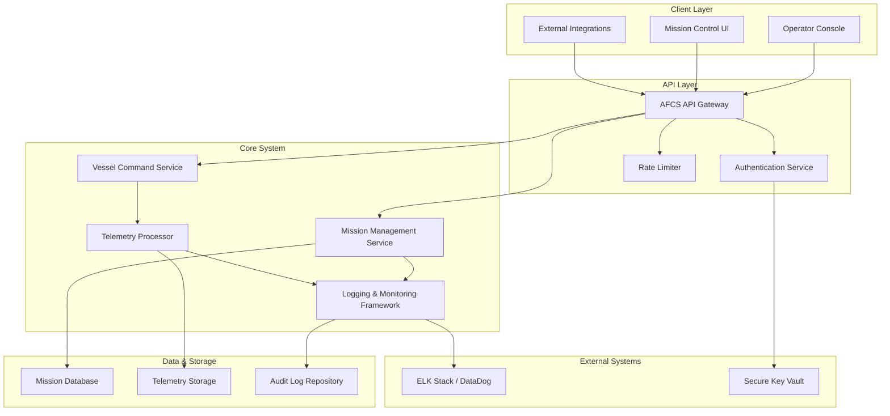
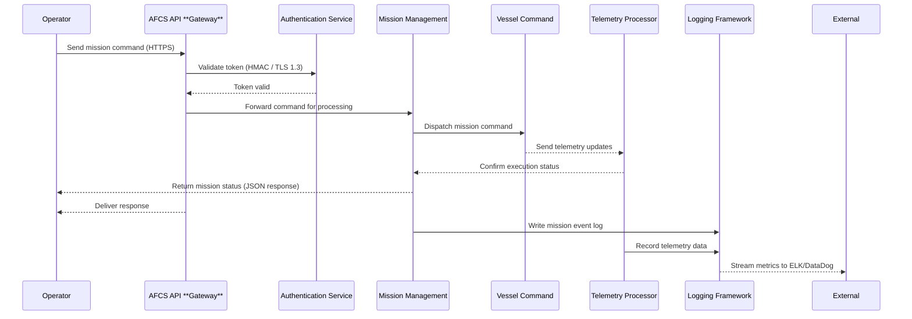

# Autonomous Fleet Coordination System (AFCS) — System Overview & Integration Guide

## Introduction

The Autonomous Fleet Coordination System (AFCS) is a cloud-based system designed to manage and monitor fleets of unmanned surface vehicles (USVs) and unmanned underwater vehicles (UUVs). AFCS allows technical integrators, system administrators, and developers to connect their own mission control or data systems, enabling coordination and unified automation across multiple interfaces and offers modularity, scalability, and security.

This guide will outline the AFCS architecture, detailing how its services interact, and how to integrate with APIs for mission scheduling, telemetry data access, and real-time alerts.

## System Overview

The Autonomous Fleet Coordination System (AFCS) employs modular, service-oriented architecture that distributes control and monitoring of autonomous vehicles. The system consists of interconnected services that manage missions, vessel telemetry, event processing, and operator interfaces.



### Core Services:
- Mission Control Service — handles mission scheduling, coordination, and lifecycle management.
- Telemetry Service — collects, normalizes, and streams live vessel telemetry data (e.g.,: position, battery level, health status).
- Fleet **Gateway** — provides a secure communication bridge between vessels and cloud infrastructure.
- Event Processing Service — manages alerts, logs, and webhook distribution to external systems.
- User Access & Security Service — manages authentication, authorization, and access control via tokens and roles.

All services use HTTPS and message queues to communicate, which ensures asynchronous and reliable data exchange.

### Data Flow Summary:



Operators or external systems issue mission commands through the API
Commands are routed through the Fleet **Gateway** to individual vessels
Vessels return telemetry and status data to the Telemetry Service
Event Processing Service distributes logs and alerts to subscribed clients
The Mission Control Service dashboard updates in real time as missions progress

## Core Components

The AFCS is composed of several key components that work together to ensure full fleet management and integration capabilities. As described above, the following core components make up the Helix platform, each responsible for specific sets of functions while seamlessly communicating with each other to maintain system cohesion.

### Helix Core API

The **Helix Core API’s** main functions are mission creation, telemetry retrieval, and endpoint authentication. It provides programmatic control and management of missions and vessels, supporting REST interfaces and SDKs for multiple programming languages. It communicates closely with the **Helix Orchestrator** to coordinate mission logic and ensures that live vessel data is accessible to other services.

**Inputs and Outputs:**

- Inputs — Mission creation requests (e.g., mission parameters, vessel IDs, priorities), authentication tokens, telemetry subscription requests.

- Outputs — Mission status updates, telemetry data (e.g., position, battery level, health status), authentication tokens, error responses.

### Example — Mission Creation

**Request:**

```http
POST /v1/missions
Content-Type: application/json
Authorization: Bearer <token>

{
  "mission_name": "Harbor Sweep Alpha",
  "priority": "routine",
  "vessel_id": "USV-001",
  "start_time": "2025-10-06T08:00:00Z",
  "end_time": "2025-10-06T12:00:00Z"
}
```

**Response:**

```json
{
  "mission_id": "MC-13023",
  "status": "queued",
  "created_at": "2025-10-05T19:12:00Z"
}
```

### Helix Orchestrator

The **Helix Orchestrator** handles decision-making, mission logic, and fail-safe operations. It determines how missions are executed, manages priority handling (e.g., mission priority levels, conflict resolution, dynamic re-prioritization, resource allocation), and ensures that autonomous vehicles respond to changing conditions or errors appropriately. The **Orchestrator** communicates with the other components via internal APIs, primarily interfacing with the **Helix Core API** for mission management and the **Helix Stream** for real-time telemetry and event updates.

**Inputs and Outputs:**

- Inputs — Mission instructions (e.g., mission ID, vessel assignments, mission parameters, priority levels), real-time telemetry updates, external system triggers, fail-safe signals.

- Outputs — Execution status updates, mission completion or failure notifications, dynamic mission re-prioritization results, fail-safe trigger alerts.

### Example — Mission Prioritization Update

**Request:**

```http
PATCH /v1/missions/MC-13023/priority
Content-Type: application/json
Authorization: Bearer <token>

{
  "priority": "high",
  "reason": "Collision risk detected in planned path"
}
```

**Response:**

```json
{
  "mission_id": "MC-13023",
  "priority": "high",
  "status": "in-progress",
  "updated_at": "2025-10-06T09:15:00Z",
  "notes": "Priority escalated due to potential collision risk"
}
```

### Example — Telemetry-Based Fail-Safe Trigger

**Request:**

```http
POST /v1/orchestrator/failsafe
Content-Type: application/json
Authorization: Bearer <token>

{
  "mission_id": "MC-13023",
  "vessel_id": "USV-001",
  "event": "battery_low",
  "timestamp": "2025-10-06T10:15:00Z"
}
```

**Response:**

```json
{
  "mission_id": "MC-13023",
  "vessel_id": "USV-001",
  "action_taken": "return_to_base",
  "status": "in-progress",
  "timestamp": "2025-10-06T10:15:02Z"
}
```

### Helix Stream

The **Helix Stream** performs live updates, supports message queues, and manages event subscriptions. It is responsible for streaming telemetry, events, and status changes to clients while ensuring ordered, reliable event delivery. The **Helix Stream** communicates with the other components via WebSockets, message queues, and webhook subscriptions, providing a continuous data flow between the **Helix Core API**, **Orchestrator**, and connected clients.

**Inputs and Outputs:**

- Inputs — Telemetry and event streams (e.g., position, battery level, mission updates), webhook registration requests, subscription filters, and authentication tokens.

- Outputs — Real-time event feeds, mission and telemetry updates, webhook event notifications, and delivery status acknowledgments.

### Example — Telemetry Stream Subscription

**Request:**

```http
POST /v1/stream/subscribe
Content-Type: application/json
Authorization: Bearer <token>

{
  "vessel_id": "USV-001",
  "event_types": ["telemetry", "mission_status"],
  "delivery_method": "websocket"
}
```

**Response:**

```json
{
  "subscription_id": "SUB-20482",
  "vessel_id": "USV-001",
  "status": "active",
  "connected_at": "2025-10-06T10:25:00Z"
}
```

### Example — Webhook Event Delivery

**Response:**

```json
{
  "event_type": "mission_status",
  "mission_id": "MC-13023",
  "status": "completed",
  "timestamp": "2025-10-06T12:45:30Z"
}
```

### Helix Secure Gateway

The **Helix Secure Gateway** handles token management, rate limiting, and encryption. Acting as a secure bridge between AFCS components and external clients, it enforces authentication and access policies to protect system integrity and maintain consistent access control across services. The **Gateway** uses HTTPS endpoints to communicate with the **Orchestrator** and **Core API**, allowing for smooth integration among the components.

**Inputs and Outputs:**

- Inputs — Authentication requests (e.g., login credentials, API tokens), internal access verification requests, encryption key exchanges, and rate-limit checks.

- Outputs — Access tokens, session validation responses, encrypted communication acknowledgements, and rate-limit status/error responses (e.g., `429 Too Many Requests`).

### Example — Token Generation

**Request:**

```http
POST /v1/auth/token
Content-Type: application/json

{
  "client_id": "afcs_admin",
  "client_secret": "secure_key_84ds8f",
  "grant_type": "client_credentials"
}
```

**Response:**

```json
{
  "access_token": "gmrglwfwf06060245",
  "token_type": "Bearer",
  "expires_in": 3600,
  "issued_at": "2025-10-06T10:45:00Z"
}
```


### Helix SDKs

The **Helix SDKs** allow for client-facing tools for easy integration. It is responsible for providing libraries for supported programming languages (e.g., Python, Java, JavaScript), simplifying authentication, mission commands, and telemetry output, while ensuring consistent developer experience and API usage.

**Inputs and Outputs:**

- Inputs — SDK method calls (e.g., `createmission()`, `getTelemetry()`, `authenticate()`) configuration parameters, and credentials.

- Outputs — Mission creation results, telemetry data objects, authentication tokens, and standardized error responses.

### Example — Mission Creation (Python SDK)

**Request:**

```python
from helix_sdk import HelixClient

client = HelixClient(client_id="afcs_admin", client_secret="secure_key_84ds8f")

mission = client.create_mission(
    mission_name="Harbor Sweep Alpha",
    vessel_id="USV-001",
    priority="routine",
    start_time="2025-10-06T08:00:00Z",
    end_time="2025-10-06T12:00:00Z"
)

print(mission.status)
```

**Response:**

```json
{
  "mission_id": "MC-13023",
  "status": "queued",
  "created_at": "2025-10-05T19:12:00Z"
}
```

## System Integration and Communication Workflow

**Requirements:**

Client credentials (e.g., `client_id`, `client_secret`) for the **Helix Secure Gateway.**
Network access to the API base via HTTPS.
Secure storage for secrets and tokens.
Clock synchronization on client servers — important for replay protection.

### Step 1. Authentication

1. Authentication is the beginning of all API systems, where the client must receive a token to move forward with inputting requests. Requests without a valid token will return `401 Unauthorized` or `403 Forbidden` errors.
2. Client requests a token from the **Gateway** (`POST /v1/auth/token`) with `client_id` and `client_secret`.
3. The **Gateway** returns a Bearer token (`access_token`) with `expires_in` (120 seconds)
Client attaches the Bearer token (`Authorization: Bearer <token>`) to subsequent requests.
Tokens are valid for 120 seconds — clients must re-authenticate after expiration

### Example — Token Generation

**Request:**

```http
POST /v1/auth/token
Content-Type: application/json

{
  "client_id": "afcs_admin",
  "client_secret": "secure_key_84ds8f",
  "grant_type": "client_credentials"
}
```

**Response:**

```json
{
  "access_token": "gmrglwfwf06060245",
  "token_type": "Bearer",
  "expires_in": 120,
  "issued_at": "2025-10-06T10:45:00Z"
}
```

**Error Handling Notes:**

- `401 Unauthorized` — Invalid `client_id` or `client_secret`.
- `403 Forbidden` — Token scope insufficient for requested resource.
- `429 Too Many Requests` — Client exceeded rate limits.
- Tokens expire after 120 seconds — expired tokens must be refreshed with a new authentication request.

### Step 2. Mission Creation

Mission creation occurs through the **Helix Core API**. The **Core API** is used to create and schedule missions for autonomous vehicles, which is essential for initiating fleet operations.

1. Client submits mission parameters to the API using a valid Bearer token (`Authorization: Bearer <token>`)
2. The **Core API** validates the input, schedules the mission, and communicates with the **Orchestrator**
3. A mission ID (`mission_id`) and status (`status`) are returned for tracking and updates.

### Example — Mission Creation

**Request:**

```http
POST /v1/missions
Content-Type: application/json
Authorization: Bearer gmrglwfwf06060245

{
"mission_name": "The Last Jedi",
"priority": "routine",
"vessel_id": "UUV-013",
"start_time": "2025-10-06T08:00:00Z",
"end_time": "2025-10-06T12:00:00Z"
}
```

**Response:**

```json
{
  "mission_id": "MC-17269",
  "status": "queued",
  "created_at": "2025-10-06T08:00:00Z"
}
```

**Error Handling Notes:**

- `401 Unauthorized` — if the token is missing or invalid.
- `400 Bad Request` — if required fields are missing or incorrect.
- `404 Not Found` — if the specific vessel does not exist.

### Example — `409 Conflict` Error

**Request:**

```http
POST /v1/missions
Content-Type: application/json
Authorization: Bearer gmrglwfwf06060245

{
  "mission_name": "Deep Sweep Beta",
  "priority": "routine",
  "vessel_id": "UUV-013",
  "start_time": "2025-10-06T08:00:00Z",
  "end_time": "2025-10-06T12:00:00Z"
}
```

**Response:**

```json
{
  "error": {
    "code": 409,
    "message": "Vessel UUV-013 is already assigned to an active mission (MC-17269).",
    "timestamp": "2025-10-06T08:01:45Z"
  }
}
```

### Step 3. Telemetry Retrieval

Telemetry retrieval is an essential process that shows the client real-time operational awareness and mission safety. Using **Helix Stream** for live data and Helix Core API for on-demand pulls, telemetry retrieval requires valid authentication, active vessel connections, and synchronized data channels to ensure accurate, timely updates throughout mission execution.

1. Client subscribes to telemetry via `/v1/stream/subscribe` or requests summary data via `/v1/telemetry/{vessel_id}`.
2. The system authenticates the request by checking the token.
3. Data is streamed or returned in structured JSON format (e.g., position, velocity, battery level).

### Example — Telemetry Stream Subscription

**Request:**

```http
POST /v1/stream/subscribe
Content-Type: application/json
Authorization: Bearer gmrglwfwf06060245

{
  "vessel_id": "UUV-013",
  "event_types": ["telemetry", "mission_status"],
  "delivery_method": "websocket"
}
```

**Response:**

```json

{
  "subscription_id": "SUB-30651",
  "vessel_id": "UUV-013",
  "status": "active",
  "connected_at": "2025-10-06T08:15:00Z"
}
```

**Error Handling Notes:**

- `401 Unauthorized` — Token invalid or expired.
- `404 Not Found` — Vessel not connected or does not exist.
- `409 Conflict` — Telemetry stream already active for vessels.
- `503 Service Unavailable` — Stream temporarily down or data channel unstable.

### Step 4. Event & Status Updates

Event and Status updates ensure operational transparency by keeping the client informed of mission state changes (e.g., launched, paused, completed, error). Depending on the configuration, these updates could come from either the **Helix Orchestrator** or the **Helix Stream**.

1. Client subscribes to mission or system event channels (e.g., `/v1/events/subscribe`).
2. The system verifies authentication and active mission context.
3. Events are streamed live or received in batches depending on the delivery method (e.g., WebSocket, REST).

Example event types: `mission_status`. `vessel_health`, `system_health`.

### Example — Mission Event Pull

**Request:**

```http
GET /v1/events/mission/MC-17269
Content-Type: application/json
Authorization: Bearer gmrglwfwf06060245
```

**Response:**

```json
{
  "mission_id": "MC-17269",
  "event_type": "mission_status",
  "status": "in_progress",
  "timestamp": "2025-10-06T09:45:00Z",
  "details": {
    "vessel_id": "UUV-013",
    "progress": 42,
    "battery_level": 83
  }
}
```

**Error Handling Notes:**

- `401 Unauthorized` — Token invalid or expired.
- `404 Not Found` — Mission or vessel not found.
- `409 Conflict` — Event stream already active or duplicate subscription request.
- `503 Service Unavailable` — **Orchestrator** or event stream temporarily offline.

### Step 5. Command Execution

Command execution allows clients to send operational directives, including direct control or mission adjustment commands, to vessel. This step can only occur after authentication and mission activation, and ensures real-time responsiveness and operational safety.

1. Client issues commands (e.g., `pause_mission`, `resume`, `abort`, `reroute`) through the **Helix Core API**.
2. The command is validated by the **Orchestrator** to ensure safety and permission compliance.
3. The system broadcasts the action to the assigned vessel via **Helix Stream**.
4. A confirmation or error message is returned to the client.

### Example — Mission Command

**Request:**

```http

POST /v1/missions/MC-17269/command
Content-Type: application/json
Authorization: Bearer gmrglwfwf06060245

{
  "action": "pause",
  "reason": "collision_risk"
}
```

**Response:**

```json
{
  "mission_id": "MC-17269",
  "status": "paused",
  "timestamp": "2025-10-06T09:22:00Z",
  "message": "Mission paused successfully due to collision risk."
}
```

**Error Handling Notes:**

- `401 Unauthorized` — Token invalid or expired.
- `403 Forbidden` — Command not permitted for this mission state.
- `404 Not Found` — Mission or vessel does not exist.
- `409 Conflict` — Another command is already in progress.
- `503 Service Unavailable` — **Orchestrator** temporarily unreachable.


### Step 6. Mission Completion & Data Archival

Mission completion and data archival signifies the end of a mission’s lifecycle. When the mission criteria are met (e.g., final waypoint reached, operator termination signal), the operations end. Mission data, telemetry logs, and event streams are closed and archived through the **Core API**, all data becoming read-only. Archival ensures long-time traceability, data integrity, and regulatory compliance.

1. The **Orchestrator** signals mission completion.
2. The **Core API** finalizes mission state (e.g., `status: completed).
3. **Helix Stream** terminates active telemetry and event feeds.
4. Mission data (e.g., telemetry, logs, and metadata) are archived and accessible for post-mission analysis.

### Example — Mission Completion Acknowledgment

**Response:**

```http
PATCH /v1/missions/MC-17269/status
Content-Type: application/json
Authorization: Bearer gmrglwfwf06060245

{
  "status": "completed",
  "completed_at": "2025-10-06T12:45:00Z"
}
```

**Response:**

```json
{
  "mission_id": "MC-17269",
  "status": "completed",
  "archived": true,
  "archived_at": "2025-10-07T12:50:00Z"
}
```

**Error Handling Notes:**

- `401 Unauthorized` — Token expired or invalid.
- `404 Not Found` — Mission not found or already archived.
- `409 Conflict` — Mission is still active; cannot archive.
- `500 Internal Server Error` — Archival service failed or data corruption detected.

### Workflow Summary

For autonomous vehicles, the system workflow—from authentication to archiving—shows a full operational cycle. The three core components—the **Helix Core API**, **Helix Stream**, and **Helix Orchestrator**—work together to maintain continuity, coordination, and safety throughout each mission. This structure supports scalable fleet operations and system reliability across multiple vessels. Once archived, mission data is securely stored and made read-only, ensuring it is traceable and meets compliance regulations. The archived data remains accessible for analysis, tracking, reporting, and playback via the Core API. For a complete list of available commands, reference the Glossary.


## Authentication & Security

To gain access to the AFCS and ensure system integrity, clients must receive an access token, which allows authentication into the fleet control platform. This process also guarantees encrypted communication and message validation while navigating with the core components.

### Authentication Overview

Authentication is necessary to prevent unauthorized access and protect mission and vessel data. While several authentication processes exist (e.g., OAuth2, API keys), the AFCS uses a custom token-based approach that expires after a set duration.

Through the **Helix Secure Gateway**, the client will request a token using their credentials. The **Gateway** will validate their identification and respond with a Bearer token and expiration time. Every request must contain this token to access the API and other system components.

#### Permission Tiers

- Administrator — Full access to all endpoints, mission management, user administration and overall system settings.
- Operator (Mission Controller) — can create, update, and manage missions for assigned vessels; can issue commands but cannot modify users or system settings
- Observer (Analyst) — read-only access to telemetry, mission logs, and archived data; cannot create or alter missions.

The AFCS uses permission tiers to control access. Each token carries role-based features, which reflect these tiers. Requests outside of the role’s scope are rejected with a `403 Forbidden` error, ensuring secure, role-appropriate access.

### Secure Communication & Token Usage

- HTTPS — All requests to AFCS components must use HTTPS to ensure encryption in transit.
- HMAC (Message Validation) — Certain endpoints (e.g., Helix Stream event delivery) require an HMAC signature to verify message authenticity and prevent tampering.
- Rate Limits — The **Helix Secure Gateway** enforces request limits per client to prevent abuse. Exceeding the limits returns a `429 Too Many Requests` response.
- Token Expiration — AFCS tokens are temporary (120 seconds) to reduce the risk of replay attacks. Clients must re-authenticate and request a new token once expired.

### Example — Token Request

**Request:**

```http
POST /v1/auth/token
Content-Type: application/json

{
  "client_id": "afcs_admin",
  "client_secret": "secure_key_dsx360ps3",
  "grant_type": "client_credentials"
}
```

**Response:**

```json
{
  "access_token": "gmrglwfwf06060245",
  "token_type": "Bearer",
  "expires_in": 120,
  "issued_at": "2025-10-06T10:45:00Z"
}
```


**Error Handling Notes:**

`401 Unauthorized` — Invalid `client_id` or `client_secret`.
`403 Forbidden` — Token scope insufficient for requested resource.
`429 Too Many Requests` — Rate limit exceeded..


## Best Practices
These recommendations help developers integrate with the AFCS efficiently, securely, and reliably. Following these practices will reduce errors, enhance stability, and secure operation across missions and system components.

### Reliability & Retry Strategies
- Retry Logic — Use exponential backoff when retrying failed attempts to avoid overwhelming the API or network.
- Error Handling — Fix common HTTP errors (e.g., `401`, `403`, `429`, `500`) by implementing automated recovery paths to maintain system stability.
- Version Compatibility — Verify integrations against compatibility with the current AFCS API version, with endpoints and payloads validated before production.

### Request Management
- Batch Requests — Combine multiple operations in a single API request to improve efficiency and reduce network overhead.
- Rate-Limiting Awareness — Follow API rate limits to avoid throttling or service disruption.
- Idempotency — Use unique mission patterns with mission-critical commands to avoid unintended duplicate actions.

### Security Hygiene
- Secure Key Storage — Store client credentials and API keys in encrypted vaults or environment variables, but never in source code or logs.
- Key Rotation — Rotate secrets and tokens periodically to lower the risk of compromise.
- Webhook & Message Verification — Validate message signatures (e.g., HMAC) to confirm authenticity and avoid tampering.

### Logging & Monitoring
- Structured Logging — Record key fields (e.g, `timestamp`, `mission_id`, `vessel_id`, `event`, `message`) for easy analysis.
- Centralized Monitoring — Forward logs to dashboards (e.g., ELK Stack, DataDog) for real-time data insight.
- Correlation & Filtering — Filter logs by vessel, mission, severity, and time to allow efficient troubleshooting.

## Appendix/Glossary

### A. Common API Endpoints

| Endpoint | Definition |
|--------|------|
| `/missions/start` | Launches a mission for a specified vessel |
| `missions/status` | Retrieves mission status updates |
| `vessels/{id}` | Responds with details for a specific vessel |


### B. Error Code Reference

| Error Code | Definition |
|--------|------|
| `400 Bad Request` | Invalid request format |
| `401 Unauthorized` | Missing or invalid authentication token |
| `403 Forbidden` | Insufficient permissions |
| `404 Not Found` | Resource unavailable |
| `429 Too Many Requests` | Rate limit exceeded |
| `500 Internal Server Error` | Unexpected server issue |


### C. Key Field Definitions

| Key Field | Definition |
|--------|------|
| `mission_id` | Unique mission identifier |
| `vessel_id` | Unique vessel identifier linked to mission operations |
| `timestamp` | UTC record of the event |
| `event` | System event type (e.g., `mission_started`, `command_rejected`) |
| `message` | Human-readable description of the log entry or error |


### D. Glossary

| Term | Definition |
|--------|------|
| AFCS | Autonomous Fleet Control System. The central platform that coordinates, monitors, and manages missions across connected autonomous vessels |
| API | Application Programming Interface. A defined set of endpoints and data structures used to communicate with the AFCS programmatically |
| Checksum | A calculated hash value used to verify data integrity and detect corruption or tampering |
| HMAC | Hash-based Message Authentication Code. A cryptographic signature method that verifies message authenticity and integrity between communicating systems |
| HTTPS | Hypertext Transfer Protocol Secure. The secure version of HTTP that uses encryption (typically TLS) to protect data in transit |
| Rate Limit | A defined threshold on the number of requests a client can make within a time window, preventing overload or abuse of the API |
| TLS 1.3 | Transport Layer Security version 1.3. The encryption protocol used by the AFCS to secure communications between components and clients |
| UTC | Coordinated Universal Time. The standardized global time reference used for all AFCS timestamps |
| Webhook | An automated HTTP callback that allows the AFCS to send event notifications to external systems in real time |
| Payload | The body content of a request or response, typically containing mission data, parameters, or configuration information |
